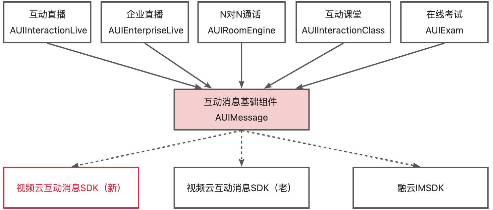
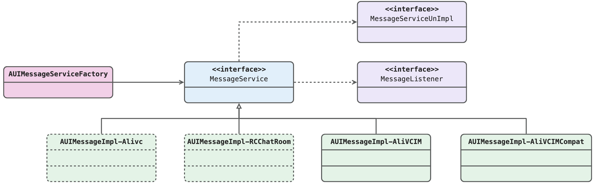
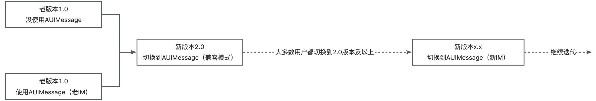
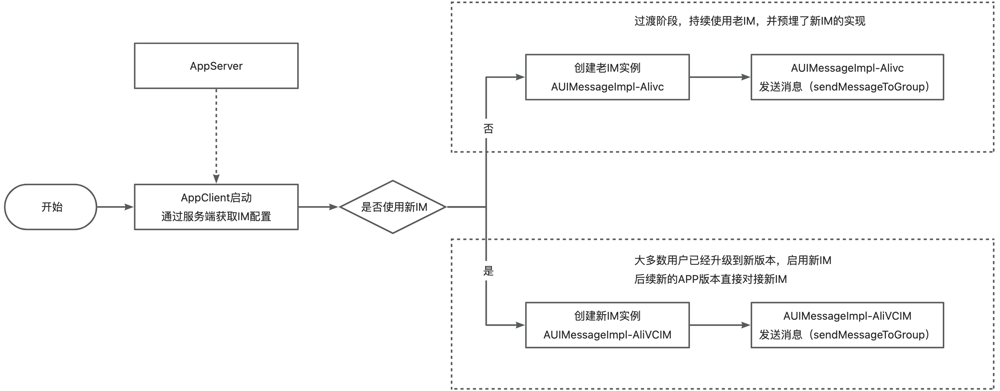

# AUIMessage

## 介绍
AUIMessage组件基于AUIKits的业务设计与与封装了一套统一接口，提供群组管理及消息收发等能力。该组件默认提供了基于阿里云互动消息SDK和融云SDK两种接口实现方式，客户可以直接引入使用，也可以基于其他信令SDK或IMSDK进行自定义实现，且无需改动上层AUIKits源码。

## 架构设计

<p align="center">
  
</p>

## 详细设计

### 接口设计
<p align="center">
  
</p>

- 接口的定义，请参考“AUIMessageService.h”文件
- 接口默认实现
  - AUIMessageImpl-Alivc：（1.0版本已支持）使用视频云老互动消息SDK实现AUIMessage接口
  - AUIMessageImpl-RCChatRoom：（1.0版本已支持）使用融云IMSDK实现AUIMessage接口
  - AUIMessageImpl-AliVCIM ：（2.0版本新增）使用视频云新互动消息SDK实现AUIMessage接口
  - AUIMessageImpl-AliVCIMCompat：（2.0版本新增）使用视频云新老SDK的动态切换方式实现AUIMessage接口，适用于已接入Alivc但又需要升级到AliVCIM

### 交互流程

<p align="center">
  
</p>

## 接入说明

### 集成
把AUIMessage文件夹拷贝到与Podfile同一目录下，选择其中一种方式并在你的Podfile进行引入：
``` ruby
# 方式1（推荐）：集成使用阿里互动消息SDK（新）实现的AUIMessage
pod 'AUIMessage/AliVCIM', :path => 'AUIMessage/'

# 方式2：集成使用阿里互动消息SDK（老）实现的AUIMessage
pod 'AUIMessage/Alivc', :path => 'AUIMessage/'

# 方式3：集成使用阿里互动消息SDK新老兼容实现的AUIMessage
pod 'AUIMessage/AliVCIMCompat', :path => 'AUIMessage/'

# 方式4：集成使用融云IMSDK实现的AUIMessage
pod 'AUIMessage/RC', :path => 'AUIMessage/'

```

### 接口调用示例
``` OBJC

// 添加Listener
[[[AUIMessageServiceFactory getMessageService] getListenerObserver] addListener:self];

// 配置
AUIMessageConfig *config = [AUIMessageConfig new];
config.tokenData = data;  // 具体的kv值，可以参考实现
[[AUIMessageServiceFactory getMessageService] setConfig:config];

// 登录
AUIMessageUserInfo *userInfo = [AUIMessageUserInfo new];
userInfo.userId = @"uid";
userInfo.userNick = @"昵称";
userInfo.userAvatar = @"http://xxxx.png";
[[AUIMessageServiceFactory getMessageService] login:userInfo callback:^(NSError *error) {
    if (error) {
        // 失败
    }
    else {
        // 成功
    }
}];

// 入群
AUIMessageJoinGroupRequest *req = [AUIMessageJoinGroupRequest new];
req.groupId = groupID;
[self.messageService joinGroup:req callback:^(NSError * _Nullable error) {
    if (error) {
        // 失败
    }
    else {
        // 成功
    }
}];

// 离群
AUIMessageLeaveGroupRequest *req = [AUIMessageLeaveGroupRequest new];
req.groupId = groupID;
[self.messageService leaveGroup:req callback:^(NSError * _Nullable error) {
    if (error) {
        // 失败
    }
    else {
        // 成功
    }
}];

// 单发消息
AUIMessageSendMessageToGroupUserRequest *req = [AUIMessageSendMessageToGroupUserRequest new];
req.groupId = groupID;
req.data = data;
req.msgType = type;
req.receiverId = receiverId;
[self.messageService sendMessageToGroupUser:req callback:^(AUIMessageSendMessageToGroupUserResponse * _Nullable rsp, NSError * _Nullable error) {
    if (error) {
        // 失败
    }
    else {
        // 成功
    }
}];

// 群发消息
AUIMessageSendMessageToGroupRequest *req = [AUIMessageSendMessageToGroupRequest new];
req.groupId = groupID;
req.data = data;
req.msgType = type;
req.skipAudit = YES;
req.skipMuteCheck = YES;
[self.messageService sendMessageToGroup:req callback:^(AUIMessageSendMessageToGroupResponse * _Nullable rsp, NSError * _Nullable error) {
    if (error) {
        // 失败
    }
    else {
        // 成功
    }
}];

// 其他接口不再示例，有需要可以参考AUIKits的使用

```

## 基于新老互动消息SDK的升级实现

### 升级策略

<p align="center">
  
</p>

### 具体实现
AUIMessageImpl-AliVCIMCompat的内部实现如下：

<p align="center">
  
</p>

### 快速集成

- 集成AliVCIMCompat
``` ruby
# 方式3：集成使用阿里互动消息SDK新老兼容实现的AUIMessage
pod 'AUIMessage/AliVCIMCompat', :path => 'AUIMessage/'

```

- 配置Config，初始化内部MessageService实例
``` OBJC

NSMutableDictionary *data = [NSMutableDictionary new];
[data setObject:_useAlivc ? @"aliyun_new" : @"aliyun_old" forKey:@"mode"];
[data setObject:@"xxx" forKey:@"xxx"]; // 设置token字段，具体参考对应的impl实现

AUIMessageConfig *config = [AUIMessageConfig new];
config.tokenData = data;
[[AUIMessageServiceFactory getMessageService] setConfig:config];

```